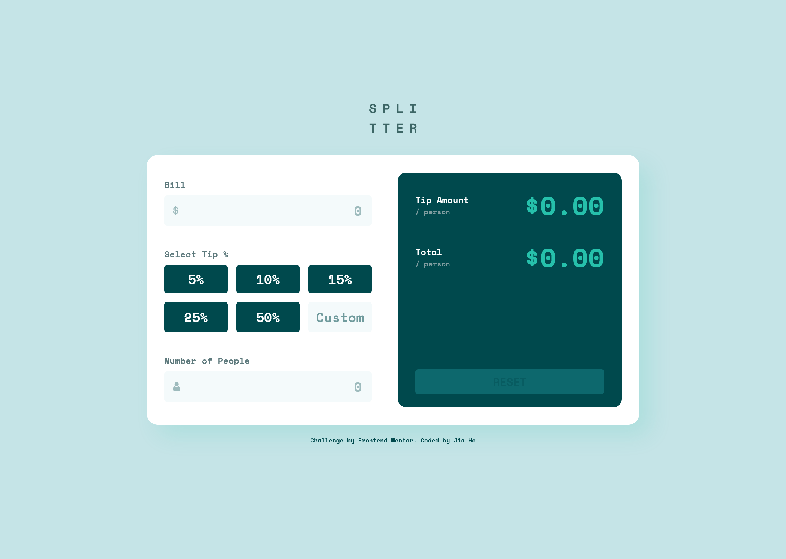

# Frontend Mentor - Tip calculator app solution

This is my solution to the [Tip calculator app challenge on Frontend Mentor](https://www.frontendmentor.io/challenges/tip-calculator-app-ugJNGbJUX). Frontend Mentor challenges help you improve your coding skills by building realistic projects.

## Table of contents

- [Overview](#overview)
  - [The challenge](#the-challenge)
  - [Screenshot](#screenshot)
  - [Links](#links)
- [My process](#my-process)
  - [Built with](#built-with)
  - [What I learned](#what-i-learned)
  - [Continued development](#continued-development)
- [Author](#author)

## Overview

### The challenge

Users should be able to:

- View the optimal layout for the app depending on their device's screen size
- See hover states for all interactive elements on the page
- Calculate the correct tip and total cost of the bill per person

### Screenshot



### Links

- Solution URL: [My solution]()
- Live Site URL: [Live site URL](https://tip-calculator-app-jiah.netlify.app/)

## My process

### Built with

- Semantic HTML5 markup
- CSS custom properties
- Flexbox
- CSS Grid
- Mobile-first workflow
- Vanilla JavaScript

### What I learned

This project helped me reinforce both my CSS layout knowledge and JavaScript form validation logic, especially when building responsive and interactive UI components.

- Centering a Container While Keeping a Logo Above: I centered the main container vertically while keeping the logo at the top using flexbox and auto margins. Here is the code:

```css
body {
  display: flex;
  flex-direction: column;
  align-items: center;
  justify-content: center;
  min-height: 100vh;
}

.container {
  margin-top: auto;
  margin-bottom: auto;
}
```

- Form Input Validation and Feedback programatically: I implemented validation for inputs like bill amount, number of people, and custom tip percentage using JavaScript and class-based visual feedback.

```js
function inputValidate(inputEl, errorEl = false, isPeople = false) {
  const value = +inputEl.value;

  inputEl.classList.remove("input-valid", "input-invalid");
  errorEl.textContent = "";

  const isEmpty = inputEl.value.trim() === "";
  const isNegative = value < 0;
  const isZero = value === 0;
  const isNotInteger = isPeople && !Number.isInteger(value);
  const isNotCustom = value < 0 && value > 100;

  if (isEmpty || isNegative || isZero || isNotInteger) {
    inputEl.classList.add("input-invalid");

    if (isEmpty) {
      errorEl.textContent = "Please type a number";
    } else if (isNegative) {
      errorEl.textContent = "Can't be negative";
    } else if (isZero) {
      errorEl.textContent = "Can't be zero";
    } else if (isNotInteger) {
      errorEl.textContent = "Must be a whole number";
    }
  } else {
    inputEl.classList.add("input-valid");
  }
}
```

### Continued development

While building this project, I came across things that I’d like to continue improving in future projects:

#### JavaScript Refactoring

As the project grew, my JavaScript became a bit harder to manage. I’d like to:

- Break logic into smaller reusable functions.

- Avoid duplicated event logic (e.g. input validation runs multiple times).

## Author

- Frontend Mentor - [@JiaHe35354](https://www.frontendmentor.io/profile/JiaHe35354)
